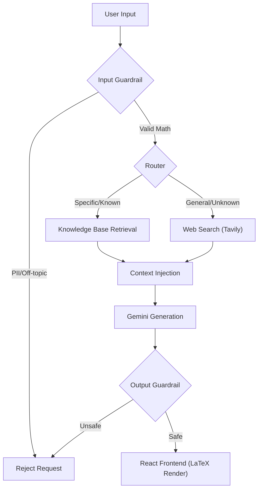

# 🧠 Agentic Math Solver


> **An intelligent, Agentic RAG system designed to solve complex mathematical problems by intelligently routing between internal knowledge bases and external web tools.**


*(Replace this link with your actual screenshot!)*

## 🧪 Architecture Flow

This system utilizes **LangGraph** to manage a cyclic state graph, ensuring robust error handling and intelligent decision-making.


| Component | Function |
| :--- | :--- |
| **Input Guardrail** | Regex & keyword analysis to block PII and ensure topic relevance. |
| **Router** | Logic layer that determines if the query requires RAG (Qdrant) or Web (Tavily). |
| **Retrieval** | Fetches relevant context to ground the LLM's response. |
| **Generation** | **Google Gemini 1.5 Flash** synthesizes the context into a step-by-step solution. |
| **Frontend** | React + KaTeX for beautiful mathematical notation rendering. |

## 🚀 Getting Started

Prerequisites

* Docker Desktop (Must be running for Qdrant)
* Python 3.11+
* Node.js 18+

1. Database Setup

Start the local Vector Database.

```
docker-compose up -d qdrant
```

2. Backend Setup

Initialize the Python environment and server.

```
cd backend
python -m venv venv
source venv/bin/activate  # Windows: venv\Scripts\activate
pip install -r requirements.txt

# Create .env file with: GOOGLE_API_KEY, TAVILY_API_KEY
touch .env
```

Load the Knowledge Base (Run once): This script embeds the dataset and populates the Qdrant collection.

```
python ../notebooks/load_kb.py
```

Start the API Server:

```
uvicorn main:app --reload
```

Server runs at: http://127.0.0.1:8000

3. Frontend Setup

Launch the React user interface.

```
cd frontend
npm install
npm run dev
```

App runs at: http://localhost:5173

## 🤝 Human-in-the-Loop Feedback
To improve the agent's performance, user feedback is collected via the UI.

* Positive/Negative feedback is captured.
* Data is stored in: data/feedback_dataset.jsonl.
* This dataset can be used for future DSPy optimization or fine-tuning.

## 📂 Repository Structure

```

├── backend/             # FastAPI, LangGraph logic, and Agent definitions
├── frontend/            # React + Vite application
├── data/                # Qdrant storage and Feedback logs
├── notebooks/           # Data loading and experimental scripts
└── docker-compose.yml   # Infrastructure configuration

```

## 🚀 System Capabilities

- [x] **Agentic RAG Architecture** (LangGraph routing)
- [x] **Knowledge Base** (Qdrant with JEE Bench dataset)
- [x] **Web Search** (Tavily integration)
- [x] **Guardrails** (Input/Output filtering for PII and topic)
- [x] **Human-in-the-Loop** (Feedback collection via React UI)
- [x] **Application** (FastAPI Backend + React Frontend)

